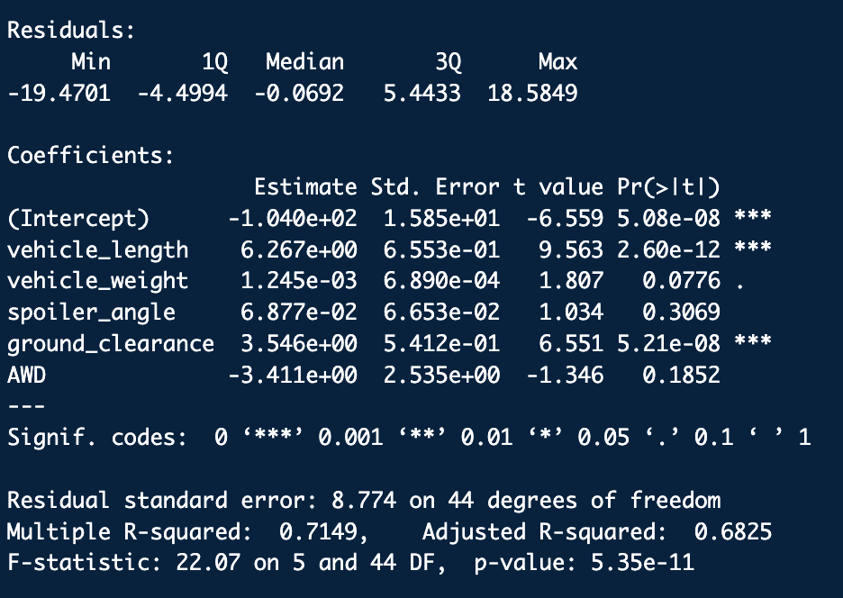
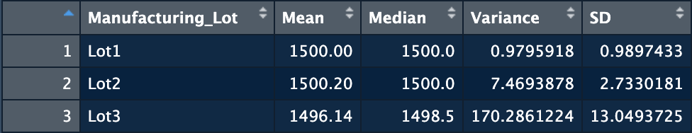
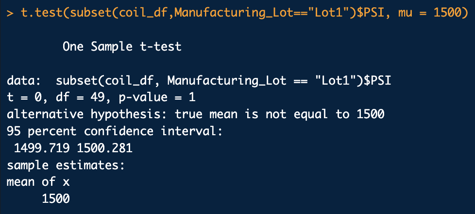
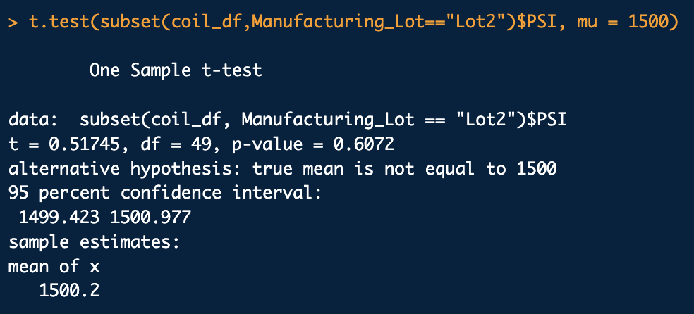
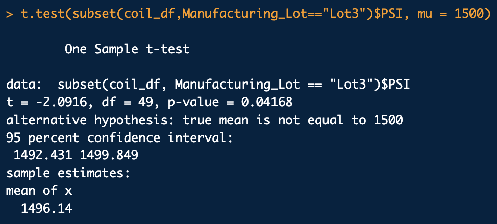

# Statistics & R

## Linear Regression to Predict MPG

    

The coefficients that provided a non-random amount of variance to the mpg values are *vehicle_weight, spoiler_angle, and ground_clearance*

The p-value (5.35e-11) is small enough that we know the slope is **not** zero.

This linear model does **not** predict mpg of MechaCar prototypes effectively, as indicated by the discourgaing R-squared value (68.25%).

---

## Summary Statistics on Suspension Coils

    
    

As a whole, the manufacturing lots satisfy the design requirements. However, individually, only Lots 1 and 2 meet the design specfications.

---

## T-Tests on Suspension Coils

    
    
    

Lot 1 and 2, both, have a sample mean of 1500, and considering their p-values- 1 and 0.61- respectfully, the null hypothesis cannot be rejected. Lot 3, on the other hand, has a p-value lower than 0.05 (0.04). Thus, the null hypothesis in the 3rd case is rejected. This information indicated that Lot 3's suspension coils must be reevaluated, especially considering the fact that it didn't meet the design specifications either.

---

## Study Design: MechaCar vs Competition

The four key parameters in the American automotive industry are probably- mileage, horespower, engine displacement, and cost. As such, these would be the metrics that we'd test.

The null hypothesis would be that the vehicle is aptly priced for the first three performance metrics. The alternative hypothesis would be that the vehicle is *not* aptly priced.

To evaluate such a dependence scenario, a mutliple linear regression seems like a logical choice to test the hypothesis. The cost would obviously be the dependent variable, and the other metrics would be the independent variables.